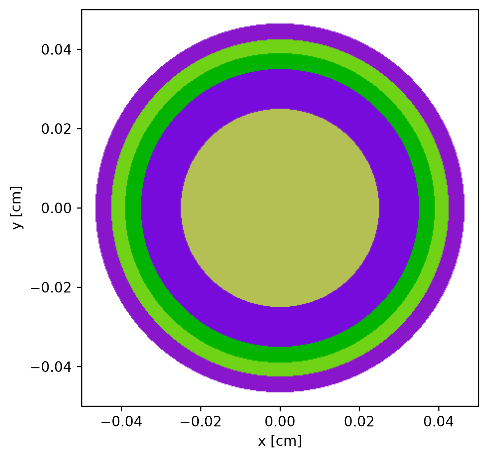
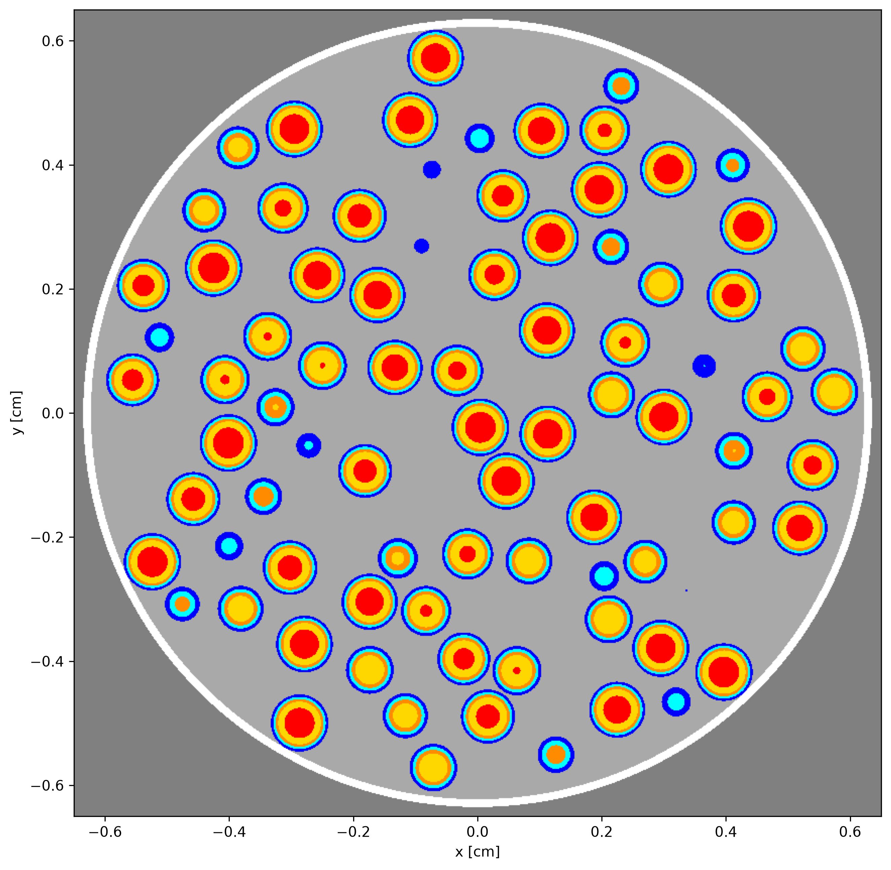
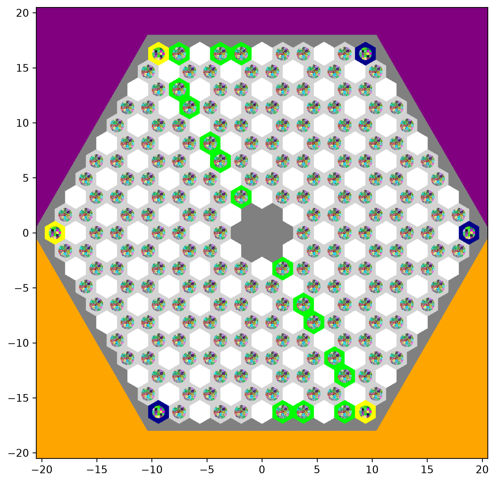
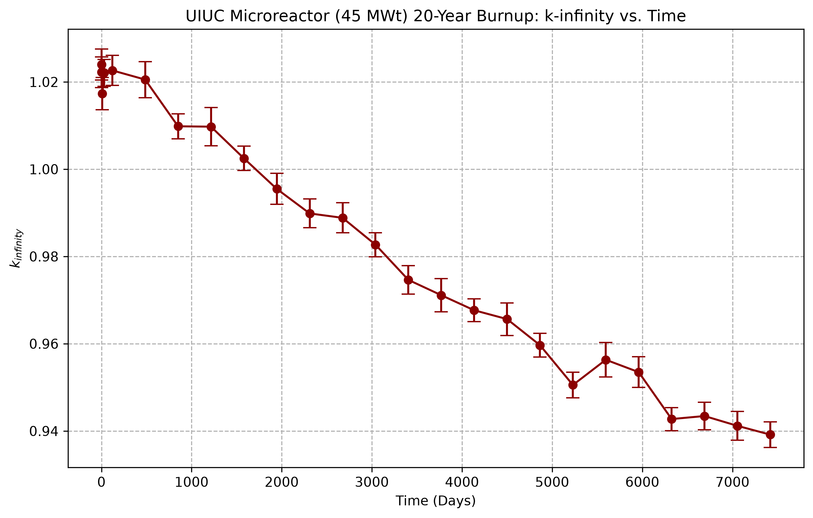
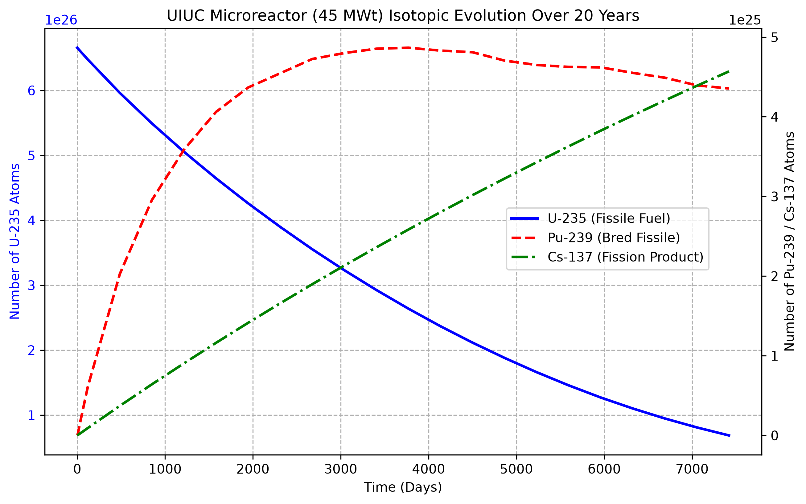

# OpenMC Core Adaptation: MHTGR-350 to a 45 MWt FCM Microreactor

**Author:** Martin Zurita  
**Objective:** A computational reactor physics study adapting the validated MHTGR-350 macro-geometry to model a 45 MWt UIUC microreactor utilizing Fully Ceramic Micro-encapsulated (FCM) TRISO fuel.

## Project Overview
This repository contains a full Monte Carlo neutron transport and depletion study utilizing **OpenMC**. The project demonstrates a bottom-up "Hybrid Core" methodology:
1. **Microscopic TRISO Modeling:** Building the exact double-heterogeneous TRISO particle layers (Kernel, Buffer, IPyC, SiC, OPyC) using standard benchmark dimensions.
2. **MHTGR-350 Benchmark:** Replicating the macroscopic MHTGR-350 core to validate the baseline Constructive Solid Geometry (CSG) and cross-sections.
3. **UIUC Microreactor Adaptation:** Modifying the baseline to model a next-generation 45 MWt microreactor. This involved shifting to 9.9% enriched HALEU UCO fuel within a Silicon Carbide (SiC) matrix, and explicitly updating the packing fraction (7,644 TRISO particles per pellet) and pellet dimensions to match FCM specifications.

The transition from a 350 MWt macroscopic core to a 45 MWt microreactor was achieved by rigorously scaling the depletable heavy metal volume to an 85-block equivalent, preserving the validated, safe power density.

## Repository Structure

* **`01_MHTGR_Benchmark/`** 
  * Contains the foundational OpenMC validation scripts based on the General Atomics MHTGR-350 design. Features 15.5% enriched fuel in a standard graphite matrix to establish baseline $k_{\infty}$ stability.
* **`02_UIUC_Microreactor/`** 
  * Contains the modified core scripts for the 45 MWt design. Features updated material definitions for 9.9% enriched FCM pellets (2.3 cm diameter).
  * **`01_Cold_State.ipynb`**: Baseline criticality at 294 K.
  * **`02_Hot_State.ipynb`**: High-temperature operations simulating Doppler broadening at 1173.15 K.
  * **`03_Depletion.ipynb`**: 20-year burnup sequence utilizing the `PredictorIntegrator` operator.

## Methodology & Core Physics
* **Cross-Sections:** ENDF/B-VII.1 continuous-energy data.
* **Thermal Physics:** Cross-section interpolation was utilized between the 900 K and 1200 K datasets to simulate the 1173.15 K (900°C) operating state.
* **Depletion Volume Scaling:** The physical FCM pellet dimensions were used to calculate the exact heavy metal mass. The depletable volume was scaled using 216 fuel channels × 31 pellets per channel × 85 physical blocks.
* **Boundary Conditions:** A 2D Radial Super-Cell model was utilized with reflective boundary conditions on the outer hexagonal prism to simulate an infinite repeating lattice.

## Core Geometry Visualization
The OpenMC Constructive Solid Geometry (CSG) was built and verified from the microscopic particle level up to the macroscopic core lattice.

### 1. Microscopic TRISO Particle
*(Validation of the multi-layered TRISO geometry including Kernel, Buffer, IPyC, SiC, and OPyC coatings.)*

### 2. FCM Fuel Pellet
*(Visualization of the updated packing fraction, containing randomly dispersed TRISO particles within the matrix.)*

### 3. Hexagonal Fuel Element
*(The fuel block mapped with cooling channels and Lumped Burnable Poisons, utilizing `reporting_universes` to isolate specific flux and tally regions.)*

### 4. Macroscopic Core Lattice
*(The full super-cell layout featuring active fuel blocks surrounded by burned bottom fuel and outer graphite reflector blocks.)*

## Preliminary Results
* **Cold-State Baseline (294 K):** The integration of heavy Boron-10 Lumped Burnable Poisons (LBPs) alongside the reduced 9.9% enrichment successfully suppressed excess reactivity, yielding a realistic, highly manageable startup $k_{\infty}$ of **1.08924 ± 0.00026**.
* **Hot-State Operations (1173.15 K):** Doppler broadening of U-238 absorption resonances successfully reduced the baseline reactivity, resulting in a stable, safe operating $k_{\infty}$ of **1.02684 ± 0.00026**.
* **20-Year Depletion (45 MWt):** 

